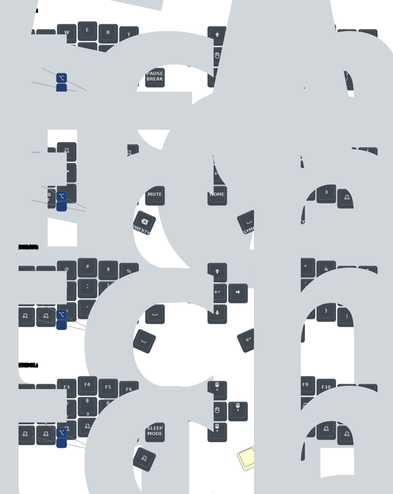

# Eyelash Corne with Nice View Gem in ZMK


This ZMK configuration is for a keyboard with a rotary encoder and a pointer device available at [xcmkb](https://xcmkb.com/products/wireless-corne-mx-joystick), [panadakb](https://pandakb.com/products/keyboard-kit/corne-j-zmk-wireless-keyboard-with-5-way-switch-and-knob/) and [AliExpress](https://www.aliexpress.us/item/3256807449244665.html)

Additionally, you'll need some switches and keycaps.
  **Switches**: I prefer the Yellow Gateron Pro Hot Swap 5Pin 50g Switches bought from [AliExpress](https://www.aliexpress.us/item/3256803154203988.html)
  **Keycaps**: You can order your [custom keycap set](https://yuzukeycaps.com/c/bdfc50f2-9d9b-4a87-9f24-02cc43ce19a2) for the configuration from YUZU keycaps

This configuration is inspired by [Miryoku](https://github.com/manna-harbour/miryoku_zmk) and contains a sleek looking customized nice!view shield inspired by [nice_view_gem](https://github.com/M165437/nice-view-gem) and it also generates a keymap for reference

Total cost: $154 (~$182 with tax and shipping)

## Instructions

1. [Fork this repository](https://docs.github.com/en/get-started/quickstart/fork-a-repo#forking-a-repository)
2. [Click the **Actions** tab and make sure the workflow is enabled](https://docs.github.com/en/actions/managing-workflow-runs-and-deployments/managing-workflow-runs/disabling-and-enabling-a-workflow#enabling-a-workflow)
3. Update the remotes in `config/west.yml` this will use the `boards/arm/` and `boards/shield` folder in your repo
4. Rebuild firmware using Github Actions and setup [Keymap Editor](https://nickcoutsos.github.io/keymap-editor/) as explained in [Sofle Wireless setup](https://github.com/superxc3/zmk_config_sofle)
5. Once the build is finished the new keymap drawing will be automatically updated in this README
6. Download the firmware.zip file generated by Github Actions. This contains 4 files (1 for zmk studio, 1 for reseting the board, updated config for left half and right half)
7. Connect the left half of the keyboard to your PC using usb and put it in bootloader mode by double clicking the button next to the on/off switch. This will mount the device on your PC, then copy the left half uf2 file(`nice_view_gem-eyelash_corne_left-zmk.uf2`) to this drive and it will automatically unmount once finished
8. Do the same now with the right half of the keyboard and copy the `nice_view_gem-eyelash_corne_right-zmk.uf2` file
9. This should load the new firmware on your system

**If you already have a ZMK config repository, [you can add this one as a module instead of forking](https://zmk.dev/docs/features/modules#building-with-modules)**
## Keymap Diagram



## Mouse Support

:warning: This repository defaults to an EXPERIMENTAL mouse movement branch which is slated for eventual merge into ZMK, but is not guaranteed to be stable. For more information, see [beta testing](https://zmk.dev/docs/features/modules#beta-testing) and [PR #2477](https://github.com/zmkfirmware/zmk/pull/2477).

If desired, edit your `config/west.yml` to switch back to `zmkfirmware`'s `main` branch:

```diff
diff --git a/config/west.yml b/config/west.yml
index ac30a68..70ad540 100644
--- a/config/west.yml
+++ b/config/west.yml
@@ -13,8 +13,8 @@ manifest:
     - name: zmk
-      remote: petejohanson
-      revision: feat/pointers-with-input-processors
+      remote: zmkfirmware
+      revision: main
       import: app/west.yml
   self:
     path: config
```
